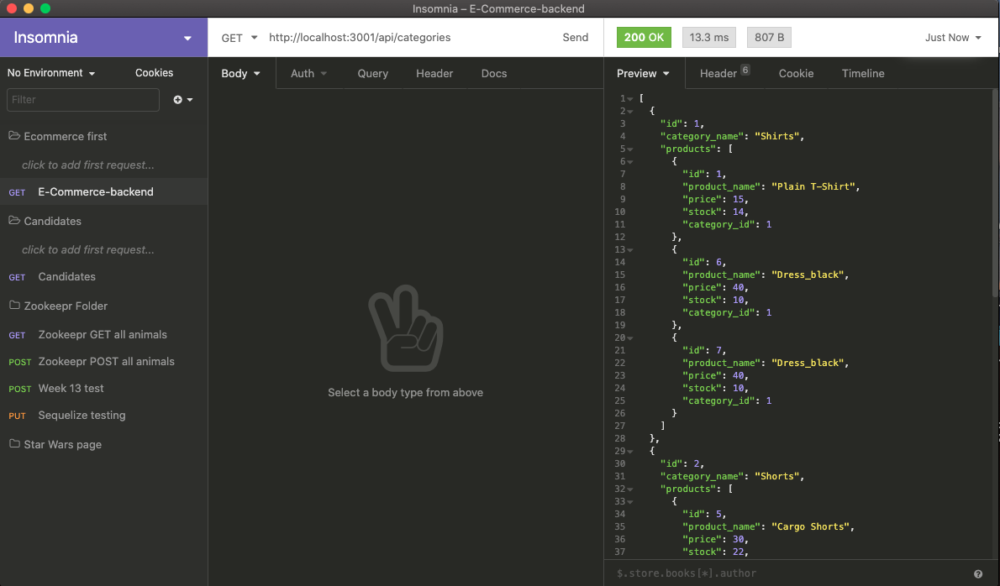
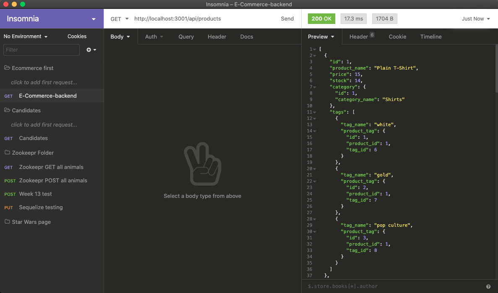
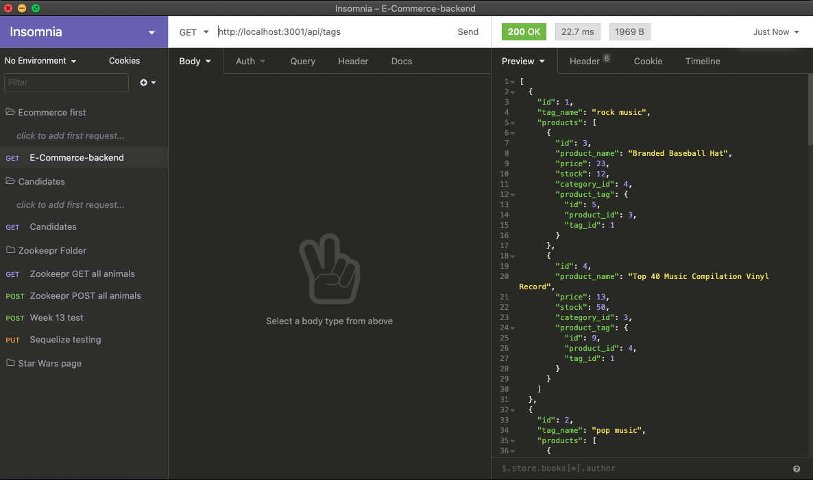

# E-commerce-back-end

## Description

The Backend of an Ecommerce retail store. this application  uses node.js, sequelize, mysql, and javascript to run the back end data.

## User Story 

AS A manager at an internet retail company
I WANT a back end for my e-commerce website that uses the latest technologies
SO THAT my company can compete with other e-commerce companies

## Acceptance Criteria

GIVEN a functional Express.js API
WHEN I add my database name, MySQL username, and MySQL password to an environment variable file
THEN I am able to connect to a database using Sequelize
WHEN I enter schema and seed commands
THEN a development database is created and is seeded with test data
WHEN I enter the command to invoke the application
THEN my server is started and the Sequelize models are synced to the MySQL database
WHEN I open API GET routes in Insomnia Core for categories, products, or tags
THEN the data for each of these routes is displayed in a formatted JSON
WHEN I test API POST, PUT, and DELETE routes in Insomnia Core
THEN I am able to successfully create, update, and delete data in my database

## Installation
Make sure you have node.js installed and mysql installed on your computer. Have the right username and password for your mysql database. After cloning the repository, run the command "npm install" from your integrated terminal to make sure al dependencies are installed onto your project.

## Usage
Open the termainl in the root directory of your project. 
Log into mysql with the following command "mysql -u {username} -p" and make sure your type in you password. 
Next run "source db/schema.sql" to create the database.
Then quit out by typeing "quit into the caommand line.
From ther terminal run the command "npm run seed".
Finally run "npm start" to start ther server.
Open Insomnia core to run (CRUD) operations. Create, read, update, delete. 
Using "localhost:3001/api/" you can now run the sperate api endpoints known as categories, product and tags using the GET, POST, PUT and DELETE request types in Insomnia core to add to the data. 

## Screenshots

## Quesstions
  * Github Username: Aken00
  * [User Github](https://github.com/Aken00)
  * You can reach me at (ajken04@gmail.com)

## Links
Visit deployed project at:https://github.com/Aken00/E-commerce-back-end
Visit demo video at:https://drive.google.com/file/d/16-xIKxeqEGQe60sH9yskyioVHaZXfJAP/view?usp=sharing